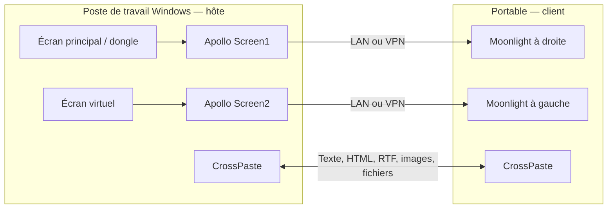

# Apollo Desktop Kit

Retrouver son poste de travail sur plusieurs écrans, depuis un portable Windows ou Linux : un flux Moonlight par écran, des résolutions indépendantes, un presse-papiers partagé et un lancement unique.

Ce dépôt documente un montage de bureau concret et fournit les scripts pour le reproduire. Il ne remplace pas Apollo, Apollo Fleet Launcher, Moonlight ou CrossPaste. Les versions téléchargées sont figées et leurs SHA-256 vérifiés dans [`packages.json`](packages.json).

## Le montage de référence

| Écran du client | Instance distante | Source sur le poste de travail | Flux | Affichage local |
|---|---|---|---|---|
| Portable à gauche, principal | Screen2 | Écran virtuel Apollo | 1920 × 1008 | Fenêtre |
| Écran externe à droite, secondaire, 2560 × 1080 | Screen1 | Écran principal physique ou dongle HDMI du GPU | 3200 × 1350 | Plein écran sans bordures |

Le facteur **1,25** concerne ici la résolution du flux : 2560 × 1,25 = 3200 et 1080 × 1,25 = 1350. On calcule une image plus grande, puis on l'affiche sur l'écran local. Ce n'est pas le réglage Windows « texte et applications à 125 % ».



Les deux instances montrent **le même bureau Windows étendu**. Elles ne créent pas deux utilisateurs ou deux sessions Windows isolées. Ce montage convient à une personne utilisant sa station ; deux collègues ne doivent pas piloter simultanément la même session en pensant disposer chacun d'un bureau indépendant.

## Démarrage rapide pour un collègue

1. Télécharger le ZIP de ce dépôt et l'extraire dans un dossier permanent.
2. Sur le **poste de travail Windows**, lancer `Install-host.cmd`, puis suivre [la configuration de l'hôte](docs/windows-host.md). Les installateurs Apollo/Fleet restent interactifs pour les pilotes et l'élévation Windows.
3. Sur le **portable Windows**, lancer `Install-client.cmd`. Il installe Moonlight si nécessaire, CrossPaste, un profil détectant les écrans et un raccourci sur le bureau. Voir [le guide client](docs/windows-client.md).
4. Associer une fois chaque instance dans Moonlight, puis associer les deux PC dans CrossPaste avec le code affiché par le PC destinataire.
5. Modifier les noms des hôtes dans le profil client pour qu'ils correspondent à ceux de Moonlight. Lancer ensuite **Apollo - My screens**.

Pour reprendre directement l'exemple ci-dessus depuis PowerShell :

```powershell
Copy-Item .\examples\two-screens.json .\profile.local.json
# Remplacer Screen1 et Screen2 dans ce fichier par les noms associés dans Moonlight.
powershell -NoProfile -ExecutionPolicy Bypass -File .\windows\Install-Client.ps1 -ProfilePath .\profile.local.json -PairClipboard
```

Conserver le dossier contenant `profile.local.json` : le raccourci le référence. Les téléchargements représentent plusieurs centaines de Mo. L'installateur client utilise le compte Windows courant, sans demander un mot de passe administrateur pour les archives portables.

## Guides

- [Hôte Windows : Apollo, Fleet, écran physique + virtuel, résolution automatique](docs/windows-host.md)
- [Client Windows : installation, profils et lancement](docs/windows-client.md)
- [Client Linux : installation, X11 et limites Wayland](docs/linux-client.md)
- [Résolutions, facteur 1,25, ordre et orientation des écrans](docs/displays.md)
- [Presse-papiers bidirectionnel et fichiers](docs/clipboard.md)
- [Télétravail : LAN, WireGuard, autres VPN et WAN direct](docs/network.md)
- [Souris, glisser-déposer et dépannage](docs/troubleshooting.md)
- [Validation et limites connues](docs/validation.md)

## Ce qui est effectivement pris en charge

| Fonction | État |
|---|---|
| Hôte Windows Apollo + Fleet | Guide et installation assistée |
| Hôte Linux identique avec Fleet/SudoVDA | **Non fourni** : Fleet est Windows, l'écran virtuel intégré Apollo aussi |
| Client Windows, un flux par moniteur | Script avec placement et plein écran sans bordures |
| Client Linux | Installation ; placement X11 proposé, à valider sur la distribution cible |
| Client Linux Wayland | Moonlight fonctionne selon sa prise en charge ; placement par règles du compositeur |
| Presse-papiers | CrossPaste configuré par défaut ; association initiale des PC nécessaire |
| Résolution personnalisée NVIDIA | Testée sur Windows/RTX 3090 ; création si absente, application et restauration |
| Même ordre gauche/droite ou haut/bas | Outil de placement hôte, à appliquer une fois les écrans actifs |
| Passage du curseur sans raccourci initial | Mode souris bureau + fenêtre sans bordures ; à confirmer sur le client utilisé |
| Glisser une fenêtre à travers deux sessions sans relâcher | **Non corrigé** par ces scripts ; limitation d'entrée entre sessions détaillée dans le guide |

## Versions, contributions et publication

Le kit est distribué sous licence MIT. Les applications téléchargées conservent leurs licences respectives ; leurs binaires ne sont pas inclus dans le dépôt. Les scripts ne collectent aucun certificat d'association, clé VPN ou mot de passe.

Avant de proposer un profil, remplacer les noms de PC, adresses privées propres à votre entreprise et chemins personnels. Ne jamais publier les dossiers `%ProgramData%\ApolloFleet`, les données CrossPaste ou les paramètres d'association Moonlight.

Validation locale : `powershell -NoProfile -File .\tests\Test-Kit.ps1`. Les limites de ce test sont indiquées dans [validation.md](docs/validation.md).

Projets amont : [Apollo](https://github.com/ClassicOldSong/Apollo), [Apollo Fleet Launcher](https://github.com/drajabr/Apollo-Fleet-Launcher), [Moonlight](https://github.com/moonlight-stream/moonlight-qt), [CrossPaste](https://github.com/CrossPaste/crosspaste-desktop).
